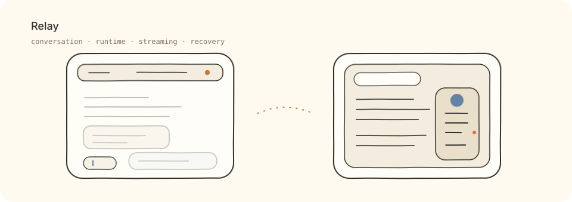
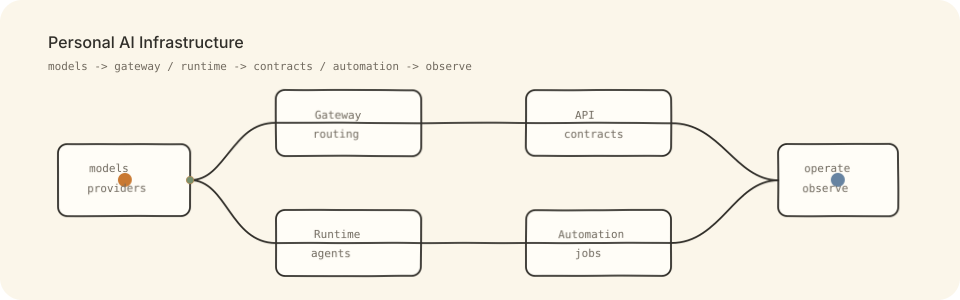
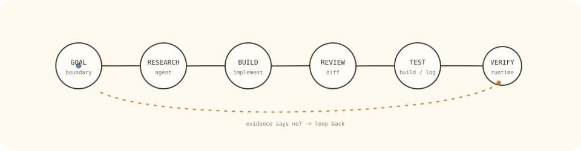
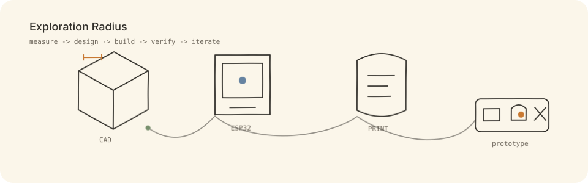

  

  前端工程师，主要使用 <b>React / TypeScript / Electron</b>。 
  最近更关注 <b>AI Agent 如何进入真实研发流程，以及它能把工程师的探索半径扩展到哪里。</b>

  <a href="https://zusheng.cc">zusheng.cc</a>
  ·
  <a href="mailto:imzusheng@163.com">Email</a>

## 最近在做

### Relay

HarmonyOS 上的 AI Agent 客户端。围绕会话、Runtime、流式消息、连接与状态恢复持续迭代。

  

### Personal AI Infrastructure

长期自用的 AI 与自动化基础设施。从模型调用、Agent Runtime、服务集成到管理与观测，跟着真实需求一点点长出来。

  

## 我怎么和 Agent 一起开发

  

**Goal / 边界 → Agent 调研 → 实现 → Diff Review → Build / Test → Runtime 验收**

Agent 主要帮我做代码库调研、跨模块定位、重复实现和验证；我更关注目标是否清楚、边界有没有被破坏，以及最终结果能不能被真实运行证据证明。

## 探索半径

最近开始把一些软件想法往实体世界推进，接触 ESP32、参数化 CAD 和 3D 打印。

这些不是我的专业能力。很多步骤依靠 Agent、资料和反复试错；真正让我感兴趣的是，**AI 能把一个软件工程师的探索半径扩展到多远。**

  

## 技术

**核心**

`React` · `TypeScript` · `JavaScript` · `Electron`

**经常使用**

`Next.js` · `Redux` · `Node.js` · `WebSocket` · `IPC` · `Canvas`

**项目实践**

`NestJS` · `PostgreSQL` · `Docker` · `HarmonyOS / ArkTS`

**Agent Workflow**

`Codex` · `Claude Code` · `OpenCode` · `MCP` · `Skills`

---

  有些探索会变成长期项目，有些只停留在某个阶段。 
  <b>重要的是不断把想法变成可以验证的东西。</b>

